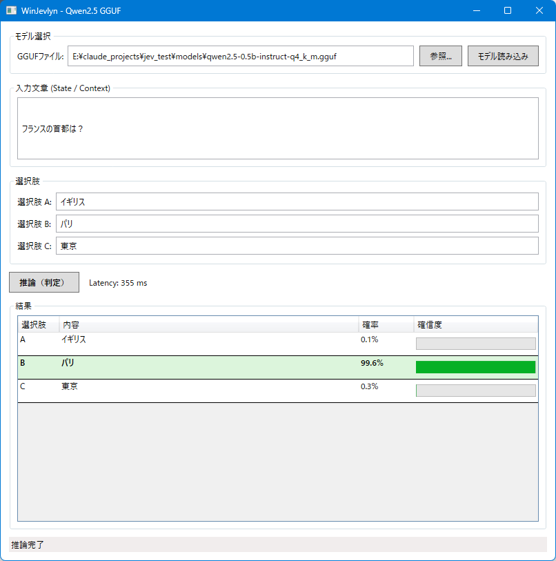

# WinJevlyn



**English**

WinJevlyn is a lightweight Windows 11 GUI for local LLM inference. Instead of generating text
token-by-token, it runs a single forward pass and reads the next-token logits directly, returning a
softmax probability over three given answer choices (A/B/C) — a fast, generation-free classification
approach. It runs GGUF models (e.g. Qwen2.5-0.5B/1.5B-Instruct) on CPU via
[LLamaSharp](https://github.com/SciSharp/LLamaSharp)/llama.cpp, and can be published as a single
self-contained `.exe`.

> ⚠️ This repository also includes an experimental **multimodal (image input) variant,
> `WinJevlyn.Multimodal`, which is an alpha release and not yet feature-complete.** It extends the
> same single-forward-pass design to accept an image alongside the text context and choices, with
> automatic GPU (CUDA) / CPU fallback. See the "WinJevlyn.Multimodal" section further down this
> page for details and known limitations.

**日本語**

WinJevlyn は、Windows 11 向けの軽量ローカル LLM 推論 GUI です。テキストを 1 トークンずつ生成する代わりに、
1 回のフォワードパスで得られる next-token logits を直接読み取り、与えられた 3 つの選択肢（A/B/C）について
softmax 確率を返す、生成を伴わない高速な分類方式を採用しています。GGUF 形式のモデル（例:
Qwen2.5-0.5B/1.5B-Instruct）を [LLamaSharp](https://github.com/SciSharp/LLamaSharp)/llama.cpp 経由で
CPU 上で動かし、自己完結型の単一 `.exe` として発行できます。

> ⚠️ 本リポジトリには、画像入力に対応した**マルチモーダル版 `WinJevlyn.Multimodal` も同梱していますが、
> こちらは α 版であり未完成です。** 同じ単一フォワードパス方式を、テキストの文脈・選択肢に加えて画像にも
> 拡張したもので、GPU（CUDA）が利用可能であれば自動的に使用し、無ければ CPU にフォールバックします。
> 詳細・既知の制限は後述の「WinJevlyn.Multimodal」セクションを参照してください。

---

- 実装: C# / .NET 8 / WPF + [LLamaSharp](https://github.com/SciSharp/LLamaSharp)（llama.cpp バインディング）
- 推論: CPU 単体、AVX2 最適化バックエンド、8 スレッド並列
- 配布: `dotnet publish` の Single-file 機能で `.exe` 1 本にまとめられます（モデルの `.gguf` は別ファイル）

## 動作原理（ロジック概要）

1. 入力文章と選択肢 A/B/C から、モデルの chat template（GGUF に埋め込まれていればそれを使用、無ければ
   プレーンテキストにフォールバック）でプロンプトを構築し、末尾を `Answer: ` で終える。
2. プロンプトをトークナイズし、1 回だけ `llama_decode` を実行（テキスト生成は行わない）。
3. 最後のトークン位置の next-token logits を取得し、"A" / "B" / "C" に対応するトークン ID の logit だけを
   抜き出して softmax（3 択の中だけで正規化）することで、各選択肢の確信度（%）を得る。
4. これにより、通常の自己回帰生成（1 トークンずつ生成→デコード）を行わずに、1 回のフォワードパスで
   3 択分類の確率分布を得られる。

該当コード: [`Services/InferenceEngine.cs`](src/WinJevlyn/Services/InferenceEngine.cs)

## 前提条件

- Windows 11
- **.NET 8 SDK**（`winget install Microsoft.DotNet.SDK.8` または
  https://dotnet.microsoft.com/download/dotnet/8.0 から入手）
- GGUF モデルファイル（例: `qwen2.5-0.5b-instruct-q4_k_m.gguf`）を別途用意してください。本リポジトリには
  モデルファイルは含まれません。
  - サンプル用モデルのダウンロード先（約 491 MB）:
    https://huggingface.co/Qwen/Qwen2.5-0.5B-Instruct-GGUF/blob/main/qwen2.5-0.5b-instruct-q4_k_m.gguf
  - モデルカード: https://huggingface.co/Qwen/Qwen2.5-0.5B-Instruct-GGUF

## ビルド・実行

プロジェクトルートの `publish.bat` を実行してください。

```bash
publish.bat
```

生成物はプロジェクトルート直下の `publish\WinJevlyn.exe` です（自己完結・単一ファイル、.NET 8
未インストールの Windows 11 でもそのまま動作します）。このファイルと GGUF モデルファイルさえあれば、
他の DLL を散乱させずに配布・実行できます。

`.bat` を使わず直接コマンドで発行したい場合:

```bash
dotnet publish src/WinJevlyn/WinJevlyn.csproj -c Release -r win-x64 \
  --self-contained true \
  -p:PublishSingleFile=true \
  -p:IncludeNativeLibrariesForSelfExtract=true \
  -p:EnableCompressionInSingleFile=true \
  -p:DebugType=None \
  -o publish
```

**配布時の注意**: 署名なし exe のため、相手先の初回起動時に Windows SmartScreen の警告（発行元不明）が
出ることがあります。「詳細情報」→「実行」で起動できます。

## Visual Studio で開く（ソース一式を配布する場合）

このリポジトリは標準的な SDK スタイルのプロジェクト（`PackageReference` 方式）なので、Visual Studio が
`LLamaSharp` / `LLamaSharp.Backend.Cpu` を **ビルド時に NuGet から自動ダウンロード**します。事前にライブラリの
DLL を手動で集めて同梱する必要はありません（モデルの `.gguf` ファイルだけは対象外なので別途用意してください）。

1. **前提条件**: Visual Studio 2022 (17.8 以降)。インストール時に「.NET デスクトップ開発」ワークロードに
   チェックを入れてください（WPF のビルドに必要）。.NET 8 SDK が無ければ Visual Studio Installer から
   追加できます。
2. リポジトリ一式（`.git` を除く場合は `bin/` `obj/` `publish/` `models/` を除いたソースツリー）を展開し、
   ルートの `WinJevlyn.sln` をダブルクリックして開く。
3. 「ビルド」→「ソリューションのビルド」（`Ctrl+Shift+B`）を実行すると、初回ビルド時に NuGet パッケージが
   自動復元されます（初回はネットワークからのダウンロードで数分かかります。今回の検証では約187MBでした）。
4. `F5`（デバッグ実行）または `Ctrl+F5`（デバッグなし実行）でそのまま起動できます。

リポジトリ直下の `NuGet.config` で参照先を `nuget.org` に固定しているため、相手先マシンの NuGet 設定に
関わらず同じ場所から取得されます。

## 画面の使い方

1. 「参照...」で GGUF ファイルを選択し、「モデル読み込み」を押す（数秒〜十数秒かかります）。
2. 「入力文章 (State / Context)」に判定させたい文脈を入力。
3. 「選択肢 A/B/C」にそれぞれのテキストを入力。
4. 「推論（判定）」を押すと、1 回のフォワードパスで各選択肢の確率が算出され、結果グリッドに表示されます。
   最も確率が高い行はハイライトされ、処理時間が `Latency: NN ms` として表示されます。

---

# WinJevlyn.Multimodal（マルチモーダル版・画像入力対応）🚧 Alpha / α版・未完成

> **[English]** This is an **alpha release.** The UI and behavior may still change, and end-to-end
> verification through actual GUI button clicks is not yet complete (the core logic itself has been
> verified against real hardware and real data). Not recommended for production use.
>
> **[日本語]** **これは α 版です。** UI・挙動は今後変更される可能性があります。GUI のボタン操作を含む
> エンドツーエンドの動作確認はまだ完了していません（コアロジック自体は実機・実データで動作確認済みです）。
> 本番用途での利用は推奨しません。

[`src/WinJevlyn.Multimodal`](src/WinJevlyn.Multimodal) は、本体 [WinJevlyn](#winjevlyn) と同じ
単一フォワードパスのロジック（1回のフォワードパスで選択肢A/B/Cの確率を直接取得、テキスト生成は行わない）を、
**画像入力にも対応させた** GUI アプリです。文脈（State / Context）と画像に加えて選択肢A/B/Cを与えると、
画像の内容を踏まえてどれが最も適切かを1回の推論で判定します。
Qwen3-VL-8B-Instruct のような視覚言語モデル（GGUF 本体 + mmproj の2ファイル構成）を対象とし、
**GPU（NVIDIA CUDA）があれば自動的に使用し、無ければ CPU にフォールバック**します。

- 実装: C# / .NET 8 / WPF + LLamaSharp の `BatchedExecutor` + Mtmd（マルチモーダル）API
- GPU/CPU 自動選択: `LLamaSharp.Backend.Cpu` と `LLamaSharp.Backend.Cuda12` を両方参照し、
  `NativeLibraryConfig.All.WithCuda(true).WithAutoFallback(true)` で実行時に自動選択します
  （詳細設計は [AGENTS.md](AGENTS.md) 参照）。CUDA 対応 GPU が無い環境でもそのまま CPU で動作します。

## モデルの用意

本体GGUFとは別に **mmproj（マルチモーダル projector）ファイルが必須**です。例:
[`Qwen/Qwen3-VL-8B-Instruct-GGUF`](https://huggingface.co/Qwen/Qwen3-VL-8B-Instruct-GGUF)

- 本体: `Qwen3VL-8B-Instruct-Q4_K_M.gguf`（約 4.68 GB）
- mmproj: `mmproj-Qwen3VL-8B-Instruct-F16.gguf`（約 1.08 GB）

**推奨 VRAM**: 本体 + mmproj + KV キャッシュで概算 6〜7GB 程度必要になるため、8GB GPU ではやや厳しい
可能性があります。12GB 以上を推奨します（GPU に乗り切らない場合は自動的に CPU にフォールバックします）。

**既知の注意点**: llama.cpp 側に Qwen3-VL のビジョン embedding 精度に関する未解決の issue があります
（[ggml-org/llama.cpp#29251](https://github.com/ggml-org/llama.cpp/issues/29251)、2026-09-21 時点で
open）。HF 版オリジナルと比べて画像理解の精度がやや劣る可能性があります。

## ビルド・実行

α版のため、単一exe配布用のスクリプトはまだありません。次のコマンドでビルド・実行してください。

```bash
dotnet run --project src/WinJevlyn.Multimodal -c Release
```

CUDA 対応 GPU があれば自動的に使用し、無い環境でも CPU で動作します（ビルドを分ける必要はありません）。

## 画面の使い方

1. 起動時に既定のモデルパスが入力済みです。別のモデルを使う場合は「本体GGUF」「mmproj」それぞれ
   「参照...」で選び直してください（2 ファイルとも選び終えてから「モデル読み込み」を押すまでは
   読み込みは始まりません）。
2. 「モデル読み込み」を押すと読み込みが始まり、完了後に「バックエンド」欄に実際に使われているのが
   GPU (CUDA) か CPU かが表示されます。
3. 「画像を選択...」で画像ファイルを選び、「入力文章 (State / Context)」に文脈を入力。
4. 「選択肢 A/B/C」にそれぞれのテキストを入力。
5. 「推論（判定）」を押すと、1 回のフォワードパスで画像を踏まえた各選択肢の確率が算出され、
   結果グリッドに表示されます。最も確率が高い行はハイライトされ、処理時間が `Latency: NN ms`
   として表示されます。
